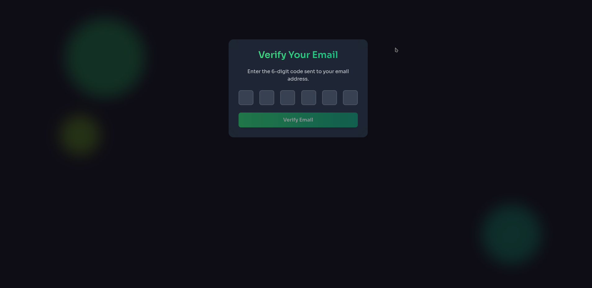
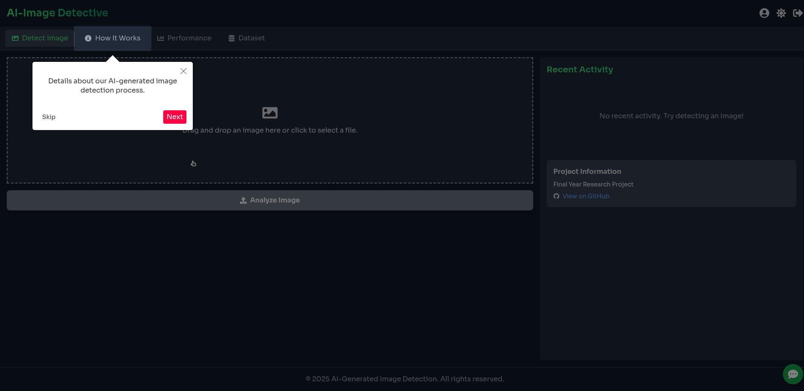

# Generated-image-detection

Research on utilizing GANs to discern between real and fake images

## Overview

The **generated-image-detection** project is a research-driven initiative focused on using Generative Adversarial Networks (GANs) to detect AI-generated images. Our system leverages advanced deep learning techniques and repurposes GAN discriminators to differentiate between genuine and synthetic facial imagery.

## Features

- **Image Detection & Analysis:**  
  - Detects AI-generated images from real ones using custom-trained GAN discriminators.
  - Evaluates performance using metrics such as Accuracy, Precision, Recall, F1 Score, and ROC-AUC.

- **Model Training & Evaluation:**  
  - Detailed research and training pipelines are provided in notebooks (e.g., `GAN.ipynb`, `WGAN.ipynb`, `Final_Project_inference.ipynb`, and `Sample Inference.ipynb`).
  - Fine-tuning of discriminators to enhance detection performance.

- **Interactive Dashboard & Chatbot:**  
  - A React-based dashboard (see `DashboardPage.jsx`) displays prediction results, detection confidence, and performance metrics.
  - A dedicated chatbot component (see `chatbot.jsx`) offers project-specific assistance and answers queries regarding the image detection methodology.
  - Tour guide for users , for our project 

## Technology Stack

- **Backend:**  
  - Express.js API integrating with LangChain’s ChatOpenAI for model queries.
  - Flask-based inference endpoint (using PyTorch) for real-time image analysis.
- **Frontend:**  
  - React (Vite) with Tailwind CSS powering the interactive user interface.
- **Deep Learning & Data Tools:**  
  - PyTorch, TensorFlow, and Torchsummary for model development.
  - Pandas, NumPy, and OpenCV for data preprocessing and augmentation.
  - Matplotlib for visualization of training and performance metrics.
- **Other Tools:**  
  - dotenv, cookie-parser, cors for secure and efficient application management.
  
## Getting Started

### Prerequisites

- Node.js (v14+) and npm.
- Python 3.x with necessary deep learning libraries (see your model requirements in `requirements.txt` or `environment.yml`).
- GPU support is recommended for model training.

### Installation

1. **Clone the repository:**
    ```bash
    git clone <repo-url>
    cd generated-image-detection
    ```

2. **Install backend dependencies:**
    ```bash
    npm install
    ```

3. **Install and build the frontend:**
    ```bash
    cd frontend/UI
    npm install
    npm run build
    ```

4. **Configure Environment Variables:**
    - Create a `.env` file in the project root with your configurations. For example:
      ```
      OPENAI_API_KEY=your_actual_api_key_here
      ```

### Running the Project

- **Development Mode:**  
  From the project root, run:
    ```bash
    npm run dev
    ```

- **Production Mode:**  
  Build and run your production bundle:
    ```bash
    npm start
    ```

- **Optional Inference with Flask:**  
  To run the separate Flask-based inference service:
    ```bash
    cd Flask-model
    python app.py
    ```
  Inference will be available at `http://localhost:5001/api/detect-image`.

## Project Structure

- **backend/**  
  Contains the Express.js API (`index.js`) that leverages LangChain’s ChatOpenAI for processing project-specific queries.
  
- **frontend/UI/**  
  The React-based UI, including components like:
  - `DashboardPage.jsx`: The dashboard for visualizing detection results and performance metrics.
  
- **Notebooks:**  
  Research and development notebooks (`GAN.ipynb`, `WGAN.ipynb`, `Final_Project_inference.ipynb`, `Sample Inference.ipynb`) that document model training, evaluation, and inference experiments.
  
- **Flask-model/**  
  Contains the inference pipeline implemented in Python (using PyTorch) for real-time image detection.

## Project Screenshots

Below are some screenshots of our project, showcasing different aspects of the AI-Image Detection system. All images are sourced from the `frontend/UI/assets/ProjectSS` folder.

<div style="display: flex; flex-wrap: wrap; gap: 1rem;">
  
   
    
    
    
    
    
    
    
    
    
    
    
    
    
    
    
     
      
       
        
         
          
          
</div>
 

## Contributing

Contributions, issues, and feature requests are welcome! Feel free to open an issue or submit a pull request.

## License

This project is licensed under the ISC License.

## Acknowledgements

- The open-source community for libraries and frameworks that make this project possible.
- Researchers and practitioners in GANs and AI image detection for their valuable insights.
- OpenAI for providing powerful APIs and tools that influence our work.

